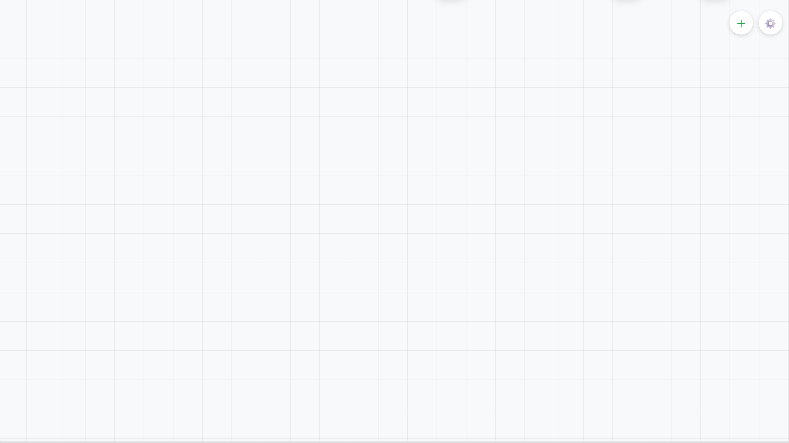
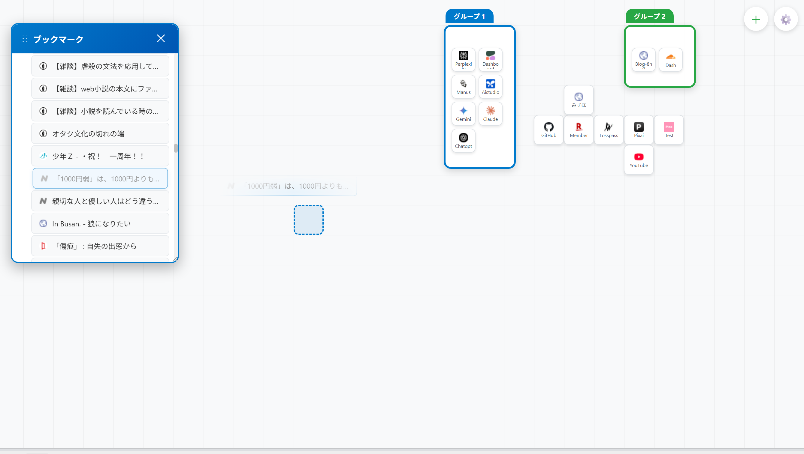
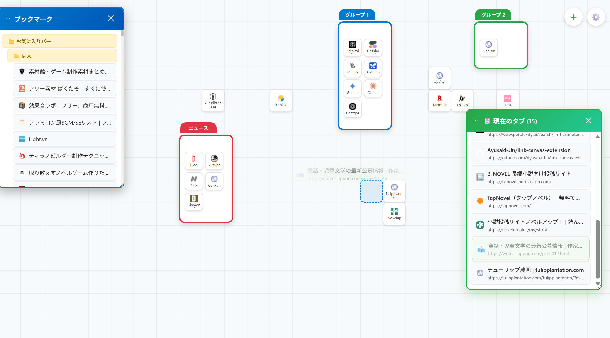
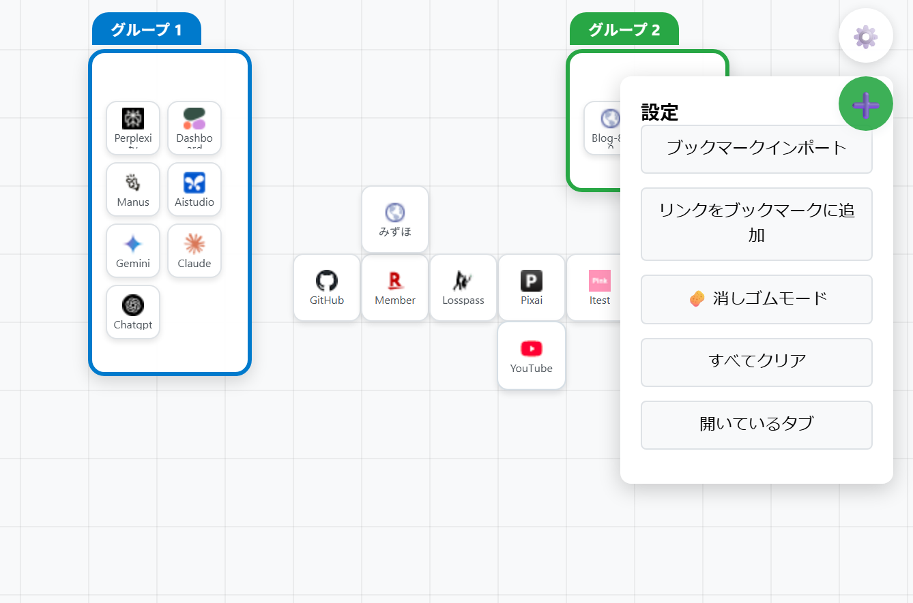
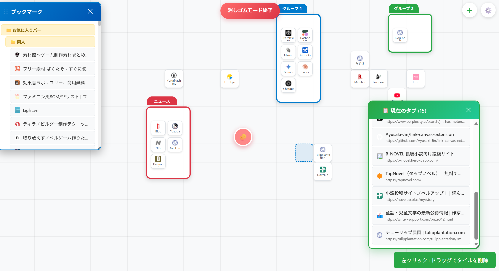

# Link Canvas

> 新しいタブを強力なビジュアルワークスペースに変える、リンク管理の新しい形

## 概要

**Link Canvas** は、Chromeの新しいタブページをフルスクリーンのキャンバスに置き換え、リンクを **自由にドラッグ＆ドロップして整理** できます。Androidのホーム画面のような直感的な操作性と、プロフェッショナルなワークスペースを融合。もう面倒なブックマークフォルダに縛られる必要はありません。

## 主な機能

### **リンクを直感的に配置**
- **ドラッグ＆ドロップ** でどこからでもキャンバスにURLを配置  
- **50pxグリッドシステム** で整然としたレイアウト  
- **クリックで開く**、**Ctrl+クリックで新しいタブで開く**  

### **リンクをスマートにグループ化**
- **自動グループ化**: 0.25秒ホバーでグループを作成  
- **9色システム** で即座に視覚的にカテゴリ分け  
- **展開・折りたたみ可能** なカスタムグループ  

### **シームレスなインポート／エクスポート**
- **ブックマークのインポート**: 既存のブックマークを視覚的に移行  
- **現在のタブのインポート**: 開いているタブを即座に整理  
- **ブックマークへのエクスポート**: 標準のChromeブックマークに統合  

### **高度なツール群**

- **右クリックメニュー**: 名前変更、削除、一括操作  
- **消しゴムモード**: 複数アイテムを選択して一括削除  

## プライバシーとセキュリティ

✅ **100%ローカル処理** — すべてのデータはローカルに保存  
✅ **外部サーバーなし** — 第三者へのデータ送信ゼロ  

## 必要な権限

| 権限         | 目的                               | 機能への影響                             |
|--------------|------------------------------------|-----------------------------------------|
| `storage`    | キャンバスレイアウトの保存           | **必須** — 核心機能                     |
| `bookmarks`  | ブックマークデータのインポート／エクスポート | **インポート／エクスポート** — 既存ブックマークの整理 |
| `tabs`       | 現在開いているタブへのアクセス       | **タブインポート** — 作業中のタブ整理     |

**注記**: `host_permissions` は不要 — Link Canvasは新しいタブ上だけで動作します。

## インストール方法

1. Chromeウェブストアからダウンロード  
2. 必要な権限を付与  
3. 新しいタブを開いて整理を始めましょう！  

## システム要件

- **Chrome 88以上** または **Edge 88以上**（Manifest V3対応）  
- **ストレージ**: 数千のリンクに最大5MBまで対応  
- **パフォーマンス**: 2秒以内の高速読み込みを実現  

## アーキテクチャ

Link Canvas/
├── Core Engine # GridManager, LinkCanvas, StorageManager
├── UI Components # ContextMenu, GroupArea
├── Advanced Features # AutoGrouping, ColorManager
└── Assets # アイコン、スタイル、アニメーション

## ライセンス

MITライセンス — 詳細は [LICENSE](./LICENSE) を参照してください。

---

**煩雑なブックマークを、整理されたビジュアルワークスペースに。**  
*Link Canvas — 直感と生産性が融合する場所。*
