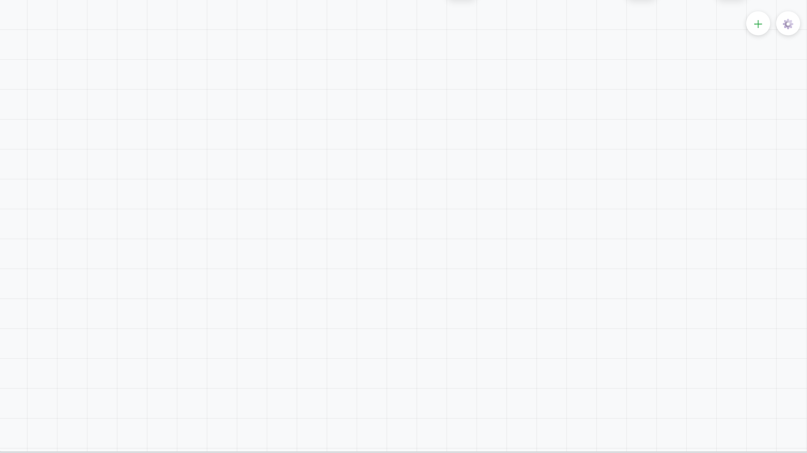
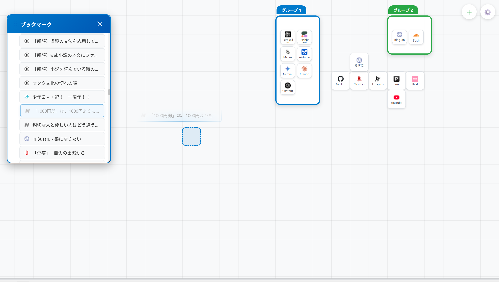
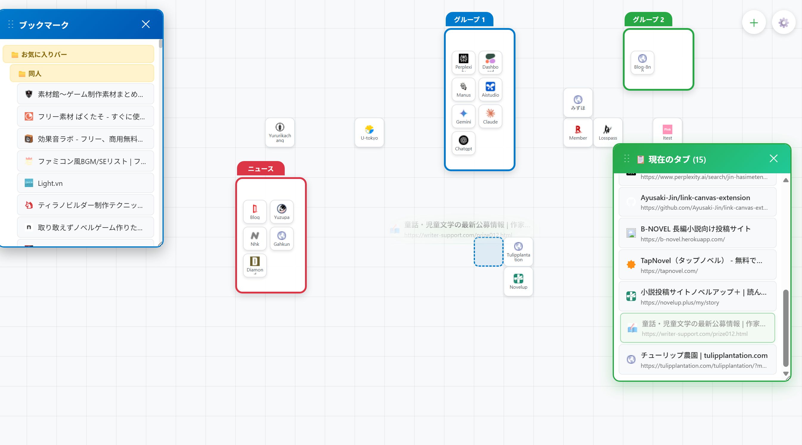
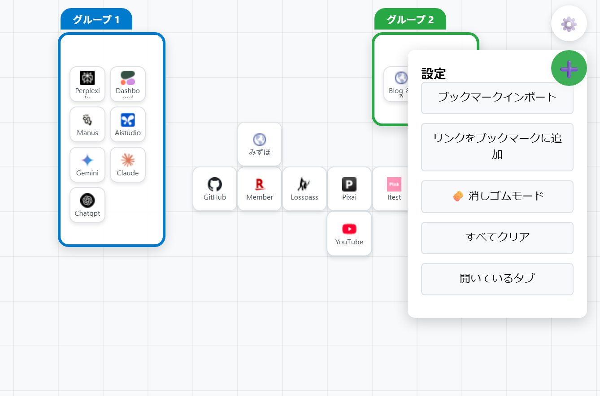
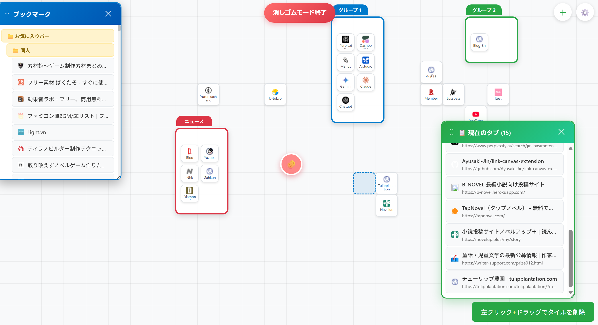

# Link Canvas

> Transform your new tab into a powerful visual workspace for link management

## Overview

**Link Canvas** replaces Chrome's new tab page with a full-screen canvas where you can **drag, drop, and organize links** with complete freedom. Think Android home screen meets professional workspace — no more rigid bookmark folders, just intuitive visual organization.

## Key Features

### **Place Links Instantly**
- **Drag-and-drop** URLs from anywhere directly onto the canvas  
- **50px grid system** for clean, aligned layouts  
- **Click to open**, **Ctrl+click** to open in a new tab  

### **Group Links Smartly**
- **Auto-grouping**: Hover links for 0.25 seconds to create groups  
- **9-color system** for instant visual categorization  
- **Expandable/collapsible** groups with custom names  

### **Seamless Import and Export**
- **Bookmark import**: Migrate existing bookmarks with visual selection  
- **Current tabs import**: Instantly organize your open tabs  
- **Export to bookmarks**: Standard Chrome bookmark integration  

### **Advanced Tools**

- **Right-click menus**: Rename, delete, and perform batch operations  
- **Eraser mode**: Drag-select multiple items for quick cleanup  
- **Undo system**: 10-step history with Chrome Sync support  

## Privacy & Security

✅ **100% Local Processing** — All data stored locally on your device  
✅ **No External Servers** — Zero data transmission to third parties  

## Required Permissions

| Permission  | Purpose                           | Feature Impact                          |
|-------------|-----------------------------------|----------------------------------------|
| `storage`   | Save canvas layouts locally       | **Essential** — Core functionality     |
| `bookmarks` | Import/export bookmark data       | **Import/Export** — Migrate bookmarks  |
| `tabs`      | Access current open tabs          | **Tab Import** — Organize open tabs    |

**Note**: No `host_permissions` required — Link Canvas operates entirely within the new tab context.

## Installation

1. Download from the Chrome Web Store  
2. Grant the required permissions  
3. Open a new tab and start organizing!  

## System Requirements

- **Chrome 88+** or **Edge 88+** (Manifest V3 support)  
- **Storage**: Up to 5MB for thousands of links  
- **Performance**: Optimized for 2-second load times  

## Architecture

Link Canvas/
├── Core Engine # GridManager, LinkCanvas, StorageManager
├── UI Components # ContextMenu, GroupArea
├── Advanced Features # AutoGrouping, ColorManager
└── Assets # Icons, Styles, Animations

## License

MIT License — See [LICENSE](./LICENSE) for details

---

**Transform cluttered bookmarks into an organized visual workspace.**  
*Link Canvas — where productivity meets intuitive design.*
